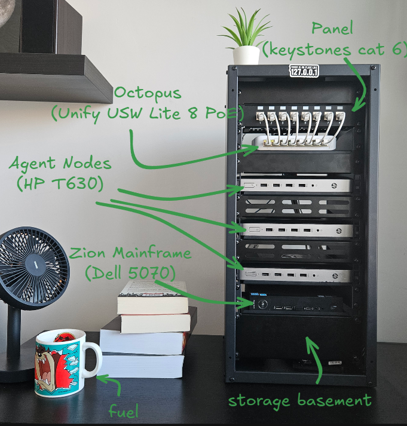

# [ k C n ]  🏠  homelab  

  
  
  
  

> "The cloud is just someone else's computer" – Ancient IT Proverb

## 🔗 Quick Links

* [:fontawesome-solid-chart-line: **Service Status**](https://status.kcn333.pl)
* [:fontawesome-brands-github: **Docker Compose Repository**](https://github.com/kCn3333/docker-compose)
* [:material-web: **My Home Page**](https://kcn333.pl)

---

## 👉 What's This All About?

Hello and welcome! This is my personal homelab documentation – a living knowledge base where I'm trying to document everything from infrastructure setup to those 3 AM debugging sessions that teach you *way* too much about Docker networking.

## 🤔 Why Self-Host?

**Reasons I run a homelab:**

1. **Fun** – Because it's actually so enjoyable
2. **Curiosity** - It's amazing to see how things work
3. **Learning** – Best way to understand infrastructure
4. **Privacy** – My data stays on my hardware
5. **Control** – I decide when things update (or break)
6. **Cost** – Cloud bills add up fast, even faster than electricity ones

## 🏗️ The Setup

  

## 📂 Documentation Sections

Browse the documentation by topic:

- **🖧 Infrastructure** - :material-server: Hardware setup, :material-server-network-outline: network configuration
- **⏻ Provisioning** - :simple-virtualbox: VM and :simple-linux: bare-metal deployment workflows
- **⛯ Applications** - :simple-docker: Docker compose, :simple-kubernetes: k8s manifests, ⛭ service configs
- **➤ Automation** - :material-ansible: Playbooks, :simple-n8n: workflows, infrastructure as code
- **🕮 Troubleshooting** - :material-head-lightbulb: Common issues and their solutions

 

---  

