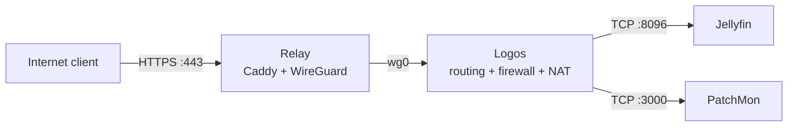

# :material-cloud-outline: Relay VPS

The Relay handles inbound traffic for the few services that must be reachable from the Internet. It connects to the homelab only through ***:simple-wireguard: WireGuard***, so no inbound service ports need to be opened on the home router.

---

## :material-server: Compute profile

| Item | Value |
|---|---|
| Provider | Oracle Cloud Infrastructure Free Tier |
| Shape | VM.Standard.E2.1.Micro |
| Operating system | Ubuntu 24.04 Minimal |
| Architecture | AMD64 |
| CPU | 1 OCPU |
| Memory | 1 GB RAM |
| Swap | 1 GB |
| Network bandwidth | 0.5 Gbps |

The VM runs native Caddy, WireGuard, Fail2ban and a PatchMon agent. Docker is not needed on the Relay.

## :material-swap-horizontal: Traffic paths



Public HTTPS terminates on the Relay and is forwarded to Jellyfin through the tunnel. The PatchMon agent uses the same tunnel to reach its server.

## :material-shield-lock-outline: Public surface

| Port | Protocol | State | Purpose |
|---:|---|---|---|
| `80` | TCP | Allowed | HTTP redirect and ACME |
| `443` | TCP | Allowed | Public HTTPS handled by Caddy |
| `<WIREGUARD_UDP_PORT>` | UDP | Allowed | WireGuard |
| `22` | TCP | Blocked publicly | SSH is available through WireGuard only |
| `3000` | TCP | Not exposed | PatchMon stays behind Logos |

The same policy is enforced in the OCI network rules and on the VM firewall.

## :simple-wireguard: WireGuard VPN

The Relay is the WireGuard endpoint. Logos initiates the tunnel from the home network.

### Relay

```ini
[Interface]
Address = <RELAY_WG_IP>/<WG_PREFIX>
ListenPort = <WIREGUARD_UDP_PORT>
MTU = 1420
PrivateKey = <RELAY_PRIVATE_KEY>

[Peer]
PublicKey = <LOGOS_PUBLIC_KEY>
AllowedIPs = <LOGOS_WG_IP>/32, <JELLYFIN_LAN_IP>/32, <PATCHMON_LAN_IP>/32
PersistentKeepalive = 25
```

The routed LAN addresses are deliberately narrow. The Relay can reach only the backends listed in `AllowedIPs`.

### Logos

```ini
[Interface]
Address = <LOGOS_WG_IP>/<WG_PREFIX>
MTU = 1420
PrivateKey = <LOGOS_PRIVATE_KEY>

[Peer]
PublicKey = <RELAY_PUBLIC_KEY>
Endpoint = <RELAY_PUBLIC_ENDPOINT>:<WIREGUARD_UDP_PORT>
AllowedIPs = <RELAY_WG_IP>/32
PersistentKeepalive = 25
```

For peer and route changes that do not modify the interface address or MTU:

```bash
sudo wg-quick strip wg0 |
sudo wg syncconf wg0 /dev/stdin
```

Restart `wg-quick@wg0` after changing the interface address or MTU.

## :material-router-network: Forwarding and NAT on Logos

Logos is the router between `wg0` and the LAN. IPv4 forwarding must be enabled:

```bash
sysctl net.ipv4.ip_forward
```

Expected result:

```text
net.ipv4.ip_forward = 1
```

The LAN backends do not have a route to the WireGuard subnet. `MASQUERADE` changes the source address to the LAN address of Logos, so replies return through Logos and can be sent back into the tunnel.

| Source | Destination | Allowed traffic |
|---|---|---|
| WireGuard | `<JELLYFIN_LAN_IP>` | Jellyfin TCP/8096 |
| `<RELAY_WG_IP>` | `<PATCHMON_LAN_IP>` | PatchMon TCP/3000 |
| WireGuard | Any other forwarded destination | Dropped |

The following is the relevant `iptables-save` representation. It documents the required state; it is not a blind replacement for the complete ruleset because Docker also manages chains on Logos.

```iptables
-A FORWARD -m conntrack --ctstate RELATED,ESTABLISHED -j ACCEPT
-A FORWARD -i wg0 -d <JELLYFIN_LAN_IP>/32 -p tcp --dport 8096 -j ACCEPT
-A FORWARD -i wg0 -s <RELAY_WG_IP>/32 -d <PATCHMON_LAN_IP>/32 -p tcp --dport 3000 -m comment --comment "Relay WG to PatchMon" -j ACCEPT
-A FORWARD -i wg0 -j DROP

-A POSTROUTING -o ens18 -d <JELLYFIN_LAN_IP>/32 -j MASQUERADE
-A POSTROUTING -s <RELAY_WG_IP>/32 -o ens18 -d <PATCHMON_LAN_IP>/32 -p tcp --dport 3000 -m comment --comment "Relay WG to PatchMon" -j MASQUERADE
```

Check the live rules and counters before changing anything:

```bash
sudo iptables -L FORWARD -n -v --line-numbers
sudo iptables -t nat -L POSTROUTING -n -v --line-numbers
sudo iptables-save
```

Rule order matters. Return traffic must be accepted, the two explicit paths must appear before the final `wg0` drop, and NAT must use the current LAN egress interface.

The persistent rules are stored in `/etc/iptables/rules.v4`. A small idempotent fallback in `/etc/rc.local` restores the Jellyfin NAT rule if Docker reloads the firewall:

```bash
iptables -t nat -C POSTROUTING \
  -o ens18 -d <JELLYFIN_LAN_IP> -j MASQUERADE 2>/dev/null || \
iptables -t nat -A POSTROUTING \
  -o ens18 -d <JELLYFIN_LAN_IP> -j MASQUERADE
```

## :material-web: Caddy

Caddy runs directly on the Relay and terminates public TLS. Jellyfin traffic is then proxied to its LAN address through WireGuard.

```caddyfile
<PUBLIC_JELLYFIN_HOSTNAME> {
    encode gzip

    reverse_proxy <JELLYFIN_LAN_IP>:8096 {
        flush_interval -1
        header_up X-Forwarded-For {remote_host}
        header_up X-Real-IP {remote_host}
        header_up Host {host}
    }

    log {
        output file /var/log/caddy/jellyfin_access.log {
            mode 0644
        }
        format json
    }

    header {
        Strict-Transport-Security "max-age=31536000; includeSubDomains"
        X-Frame-Options "SAMEORIGIN"
        X-Content-Type-Options "nosniff"
        Referrer-Policy "strict-origin-when-cross-origin"
        -Server
    }
}
```

## :material-console: Administrative access

Administration uses WireGuard only. The cloud provider console is the out-of-band recovery path when the tunnel is unavailable.

## :material-ruler: MTU

Both peers use a fixed MTU because automatic selection on the cloud interface previously produced a value that was too large for the complete path:

```ini
MTU = 1420
```

## :material-alert-outline: Known routing debt

The current WireGuard subnet overlaps the OCI VCN. Explicit `/32` peer routes keep the setup working, but the overlap makes diagnostics harder and leaves little room for expansion.

The proper fix is a coordinated move to a non-overlapping tunnel subnet. Both peers, firewall rules, routes and monitoring targets must be updated in one maintenance window.

## :material-backup-restore: Recovery data

The configuration collection includes:

### Relay

- `/etc/wireguard/`
- `/etc/caddy/`
- `/etc/fail2ban/`
- `/etc/iptables/`

### Logos

- `/etc/wireguard/`
- `/etc/iptables/`
- `/etc/rc.local`

Private keys and live credentials belong in encrypted backups, never in this repository.

## :material-tools: Troubleshooting

The failure layers, packet-tracing commands, MTU tests and recovery checks are kept in the separate [WireGuard relay troubleshooting](../troubleshooting/wireguard-relay.md) runbook.