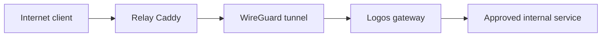

# Relay VPS

Relay is a small Oracle Cloud Infrastructure Free Tier virtual machine that provides the external edge for selected homelab services. It runs Ubuntu 24.04 Minimal with native Caddy and WireGuard.

The Relay exists because the home network does not accept direct inbound application traffic. Public HTTPS terminates in Oracle Cloud, while a narrowly scoped WireGuard tunnel carries approved requests to Logos and selected internal backends.

## Compute profile

| Component | Specification |
|---|---|
| Provider | Oracle Cloud Infrastructure Free Tier |
| Shape | `VM.Standard.E2.1.Micro` |
| CPU | 1/8 burstable OCPU |
| Memory | 1 GB RAM with 1 GB swap |
| Operating system | Ubuntu 24.04 Minimal |
| Main services | Caddy, WireGuard, Fail2ban, and PatchMon agent |

The instance is sufficient for proxying and tunnel termination, but it has limited CPU, memory, and public throughput. It is not treated as a media transcoding host or a general-purpose cloud server.

## Traffic model



The layers have distinct responsibilities:

1. public DNS directs an approved hostname to Relay;
2. Caddy terminates HTTPS and applies proxy headers and logging;
3. WireGuard transports the request to Logos;
4. Logos forwards only the approved destination and service;
5. source NAT provides a predictable return path where required;
6. all other forwarding from the tunnel is rejected.

This avoids publishing the home WAN address and does not require inbound forwarding on the home router. It does not remove the need for strong application authentication and timely patching.

## WireGuard

Relay is the stable endpoint. Logos is behind NAT and maintains the tunnel with a persistent keepalive.

The peer configuration follows a least-route model: only the peer tunnel address and explicitly approved backend routes are included. Relay does not receive a route to the complete home LAN.

Private keys, peer public keys, endpoint addresses, and the complete `AllowedIPs` values are maintained outside the public repository.

### MTU

The Oracle virtual network supports jumbo frames, but the complete public Internet path does not. Automatic MTU selection previously produced a much larger value on Relay than on Logos, causing fragmentation and avoidable retransmission risk.

Both tunnel interfaces now use an explicit MTU of `1420`.

```ini
[Interface]
MTU = 1420
```

The setting is validated at runtime because `wg syncconf` updates WireGuard peer state but does not change the interface MTU:

```bash
sudo wg-quick strip wg0 >/dev/null
sudo ip link set dev wg0 mtu 1420
ip link show wg0
```

When applying a generated configuration through `sudo`, a pipeline is preferred over shell process substitution because the elevated process may not be able to reopen the temporary file descriptor.

## Caddy

Caddy runs natively under systemd rather than in Docker. It terminates public HTTPS and forwards selected services through WireGuard.

The configuration uses:

- one site block per public service;
- structured access logs;
- explicit security headers;
- streaming-friendly proxy behaviour where required;
- validation before every reload.

```bash
sudo caddy validate --config /etc/caddy/Caddyfile
sudo systemctl reload caddy
sudo systemctl status caddy --no-pager
```

Public DNS remains DNS-only for traffic that must reach Relay directly. CDN proxying is not assumed to be appropriate for large media streams.

## Firewall model

Security is enforced in more than one place:

- the OCI network policy exposes only the required public services;
- the Relay host firewall ends in a default reject policy;
- WireGuard creates only the required routes;
- Logos accepts only explicitly approved tunnel traffic;
- remaining tunnel forwarding is dropped;
- Fail2ban protects SSH and selected Caddy authentication paths.

Rules are ordered deliberately. An allow rule placed after a blanket reject or drop rule is ineffective even when its syntax is correct.

The complete ruleset is excluded from this public documentation because it would disclose internal destinations and service paths.

## Known technical debt

The current WireGuard address space overlaps with an Oracle VCN range. Host routes make the current setup work, but the overlap makes diagnostics harder and increases the chance of a routing mistake.

Renumbering is planned as a coordinated maintenance task. It must update both peers, firewall rules, persistent routes, monitoring, and dependent service configuration in one controlled change. It should not be attempted as an isolated emergency fix.

## Backups

The remote configuration collector preserves selected Relay configuration, including:

- Caddy configuration;
- WireGuard configuration;
- Fail2ban configuration;
- persistent firewall configuration.

Private keys and recovery credentials also exist in a separate protected recovery location. A copy stored only inside the infrastructure it is expected to recover would not be sufficient.

## Operational validation

```bash
sudo wg show wg0
ip link show wg0
sudo systemctl is-active wg-quick@wg0 caddy fail2ban
sudo caddy validate --config /etc/caddy/Caddyfile
systemctl --failed --no-legend --plain --no-pager
```

End-to-end validation additionally confirms:

- a recent WireGuard handshake;
- the expected route for every approved backend;
- increasing firewall counters for the tested path;
- a valid public certificate;
- a successful backend response through Caddy;
- no unintended reachability to other LAN services.

For failure diagnosis, see [WireGuard relay troubleshooting](../troubleshooting/wireguard-relay.md).

