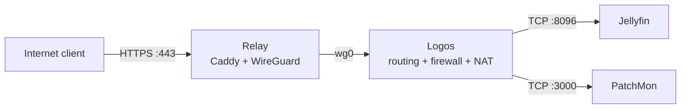

# :material-cloud-outline: Relay VPS

The Relay is a small Oracle Cloud Free Tier VM used as the public edge of the homelab. It accepts only the traffic that must arrive from the Internet and sends it through WireGuard to selected services at home.

The home router does not expose these services directly.

## :material-server: Compute profile

| Item | Value |
|---|---|
| Provider | Oracle Cloud Infrastructure Free Tier |
| Shape | VM.Standard.E2.1.Micro |
| Operating system | Ubuntu 24.04 Minimal |
| Architecture | AMD64 |
| CPU | 1 OCPU |
| Memory | 1 GB RAM |
| Swap | 1 GB |
| Network bandwidth | 0.5 Gbps |

The VM runs native Caddy, WireGuard, Fail2ban and a PatchMon agent. Docker is not needed on the Relay.

## :material-swap-horizontal: Traffic paths



| Path | Purpose |
|---|---|
| Internet → Relay → Jellyfin | Public HTTPS access to Jellyfin |
| Relay → Logos → PatchMon | Monitoring data sent by the Relay agent |
| Administrator → WireGuard → Relay | SSH administration without public TCP/22 |

PatchMon port `3000` is not exposed publicly. It is reachable from the Relay only through WireGuard and the forwarding rules on Logos.

## :material-shield-lock-outline: Public surface

| Port | Protocol | State | Purpose |
|---:|---|---|---|
| `80` | TCP | Allowed | HTTP redirect and ACME |
| `443` | TCP | Allowed | Public HTTPS handled by Caddy |
| `<WIREGUARD_UDP_PORT>` | UDP | Allowed | WireGuard |
| `22` | TCP | Blocked publicly | SSH is available through WireGuard only |
| `3000` | TCP | Not exposed | PatchMon stays behind Logos |

The same policy is enforced in the OCI network rules and on the VM firewall. OCI Cloud Console remains the break-glass access path.

## :material-vpn: WireGuard

The Relay is the WireGuard endpoint. Logos initiates the tunnel from the home network.

The examples below use descriptive placeholders instead of the real addresses:

| Placeholder | Meaning |
|---|---|
| `<RELAY_WG_IP>` | Relay address inside WireGuard |
| `<LOGOS_WG_IP>` | Logos address inside WireGuard |
| `<WG_PREFIX>` | WireGuard network prefix |
| `<WIREGUARD_UDP_PORT>` | Public UDP port used by WireGuard |
| `<JELLYFIN_LAN_IP>` | Jellyfin address on the home LAN |
| `<PATCHMON_LAN_IP>` | PatchMon address on the home LAN |
| `<PUBLIC_JELLYFIN_HOSTNAME>` | Public hostname handled by Caddy |

### Relay

```ini
[Interface]
Address = <RELAY_WG_IP>/<WG_PREFIX>
ListenPort = <WIREGUARD_UDP_PORT>
MTU = 1420
PrivateKey = <RELAY_PRIVATE_KEY>

[Peer]
PublicKey = <LOGOS_PUBLIC_KEY>
AllowedIPs = <LOGOS_WG_IP>/32, <JELLYFIN_LAN_IP>/32, <PATCHMON_LAN_IP>/32
PersistentKeepalive = 25
```

The routed LAN addresses are deliberately narrow. The Relay can reach only the backends listed in `AllowedIPs`.

### Logos

```ini
[Interface]
Address = <LOGOS_WG_IP>/<WG_PREFIX>
MTU = 1420
PrivateKey = <LOGOS_PRIVATE_KEY>

[Peer]
PublicKey = <RELAY_PUBLIC_KEY>
Endpoint = <RELAY_PUBLIC_ENDPOINT>:<WIREGUARD_UDP_PORT>
AllowedIPs = <RELAY_WG_IP>/32
PersistentKeepalive = 25
```

For peer and route changes that do not modify the interface address or MTU:

```bash
sudo wg-quick strip wg0 |
sudo wg syncconf wg0 /dev/stdin
```

Restart `wg-quick@wg0` after changing the interface address or MTU.

## :material-router-network: Forwarding and NAT on Logos

Logos is the router between `wg0` and the LAN. IPv4 forwarding must be enabled:

```bash
sysctl net.ipv4.ip_forward
```

Expected result:

```text
net.ipv4.ip_forward = 1
```

The LAN backends do not have a route to the WireGuard subnet. `MASQUERADE` changes the source address to the LAN address of Logos, so replies return through Logos and can be sent back into the tunnel.

| Source | Destination | Allowed traffic |
|---|---|---|
| WireGuard | `<JELLYFIN_LAN_IP>` | Jellyfin TCP/8096 |
| `<RELAY_WG_IP>` | `<PATCHMON_LAN_IP>` | PatchMon TCP/3000 |
| WireGuard | Any other forwarded destination | Dropped |

The following is the relevant `iptables-save` representation. It documents the required state; it is not a blind replacement for the complete ruleset because Docker also manages chains on Logos.

```iptables
-A FORWARD -m conntrack --ctstate RELATED,ESTABLISHED -j ACCEPT
-A FORWARD -i wg0 -d <JELLYFIN_LAN_IP>/32 -p tcp --dport 8096 -j ACCEPT
-A FORWARD -i wg0 -s <RELAY_WG_IP>/32 -d <PATCHMON_LAN_IP>/32 -p tcp --dport 3000 -m comment --comment "Relay WG to PatchMon" -j ACCEPT
-A FORWARD -i wg0 -j DROP

-A POSTROUTING -o ens18 -d <JELLYFIN_LAN_IP>/32 -j MASQUERADE
-A POSTROUTING -s <RELAY_WG_IP>/32 -o ens18 -d <PATCHMON_LAN_IP>/32 -p tcp --dport 3000 -m comment --comment "Relay WG to PatchMon" -j MASQUERADE
```

Check the live rules and counters before changing anything:

```bash
sudo iptables -L FORWARD -n -v --line-numbers
sudo iptables -t nat -L POSTROUTING -n -v --line-numbers
sudo iptables-save
```

Rule order matters. Return traffic must be accepted, the two explicit paths must appear before the final `wg0` drop, and the NAT rules must use the real LAN interface.

### Interface-name failure after migration

After Logos moved to Zion, WireGuard still handshaked but Jellyfin returned `502`. The saved NAT rule used the old interface name `eth0`; the VM uses `ens18`.

The backend received the SYN packet, but its reply had no valid return path through Logos. Replacing the old rule fixed the path:

```bash
sudo iptables -t nat -D POSTROUTING \
  -o eth0 -d <JELLYFIN_LAN_IP> -j MASQUERADE

sudo iptables -t nat -A POSTROUTING \
  -o ens18 -d <JELLYFIN_LAN_IP> -j MASQUERADE

sudo netfilter-persistent save
```

The persistent rules are stored in `/etc/iptables/rules.v4`. A small idempotent fallback in `/etc/rc.local` restores the Jellyfin NAT rule if Docker reloads the firewall:

```bash
iptables -t nat -C POSTROUTING \
  -o ens18 -d <JELLYFIN_LAN_IP> -j MASQUERADE 2>/dev/null || \
iptables -t nat -A POSTROUTING \
  -o ens18 -d <JELLYFIN_LAN_IP> -j MASQUERADE
```

## :material-web: Caddy

Caddy runs directly on the Relay and terminates public TLS. Jellyfin traffic is then proxied to its LAN address through WireGuard.

```caddyfile
<PUBLIC_JELLYFIN_HOSTNAME> {
    encode gzip

    reverse_proxy <JELLYFIN_LAN_IP>:8096 {
        flush_interval -1
        header_up X-Forwarded-For {remote_host}
        header_up X-Real-IP {remote_host}
        header_up Host {host}
    }

    log {
        output file /var/log/caddy/jellyfin_access.log {
            mode 0644
        }
        format json
    }

    header {
        Strict-Transport-Security "max-age=31536000; includeSubDomains"
        X-Frame-Options "SAMEORIGIN"
        X-Content-Type-Options "nosniff"
        Referrer-Policy "strict-origin-when-cross-origin"
        -Server
    }
}
```

Public HTTPS terminates directly on the Relay.

## :material-console: Administrative access

Public SSH is disabled. Administrative clients reach the Relay only through WireGuard. The cloud provider console is the out-of-band recovery path when the tunnel is unavailable.

This avoids keeping TCP/22 open to Internet scans and password-guessing traffic.

## :material-ruler: MTU

OCI exposes `ens3` with MTU `9000`. Automatic WireGuard selection previously produced MTU `8920` on the Relay while Logos used `1420`. The tunnel handshaked, but larger packets failed.

Both peers now use:

```ini
MTU = 1420
```

The useful boundary test is:

```bash
ping -M do -s 1392 <LOGOS_WG_IP>
ping -M do -s 1393 <LOGOS_WG_IP>
```

With a `1420` tunnel MTU, `1392` bytes succeeds and `1393` is too large after adding the IPv4 and ICMP headers.

## :material-alert-outline: Known routing debt

The current WireGuard subnet overlaps the OCI VCN. Explicit `/32` peer routes keep the setup working, but the overlap makes diagnostics harder and leaves little room for expansion.

The proper fix is a coordinated move to a non-overlapping tunnel subnet. Both peers, firewall rules, routes and monitoring targets must be updated in one maintenance window.

## :material-backup-restore: Recovery data

The configuration collection includes:

### Relay

- `/etc/wireguard/`
- `/etc/caddy/`
- `/etc/fail2ban/`
- `/etc/iptables/`

### Logos

- `/etc/wireguard/`
- `/etc/iptables/`
- `/etc/rc.local`

Private keys and live credentials belong in encrypted backups, never in this repository.

## :material-check-decagram: Validation

Run these checks after firewall, WireGuard or Caddy changes:

```bash
# Relay
sudo wg show
ip -br address show wg0
curl --fail --silent --show-error http://<JELLYFIN_LAN_IP>:8096/
curl --fail --silent --show-error http://<PATCHMON_LAN_IP>:3000/
sudo caddy validate --config /etc/caddy/Caddyfile

# Logos
sudo wg show
ip -br address show ens18
ip -br address show wg0
sudo iptables -L FORWARD -n -v --line-numbers
sudo iptables -t nat -L POSTROUTING -n -v --line-numbers
sudo grep -E 'wg0|MASQUERADE|PatchMon|8096|3000' /etc/iptables/rules.v4
```

Counters should increase on the expected `FORWARD` and `POSTROUTING` rules while testing each service.

For symptom-based diagnostics, see [:material-tools: WireGuard relay troubleshooting](../troubleshooting/wireguard-relay.md).