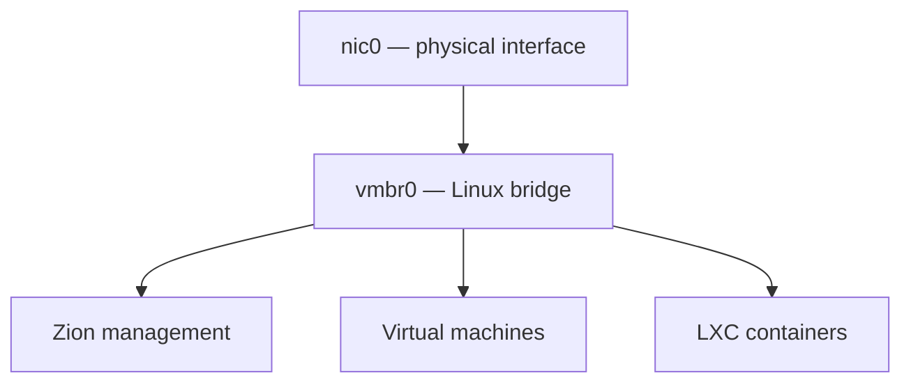

# :simple-proxmox: Proxmox link recovery

Zion remained powered on after an upstream link interruption but did not always recover network connectivity. Because the management address, VMs and LXC containers all use the same bridge, the complete virtualized platform appeared offline.

## :material-alert-outline: Symptoms

- SSH and the Proxmox web interface stop responding;
- every guest attached to the main bridge becomes unreachable;
- Zion remains powered on;
- connectivity returns after manual recovery or reboot;
- the incident follows a router, switch, cable or power interruption.

## :material-bridge: Network model



The management address belongs to `vmbr0`. `nic0` has no IP address and acts only as a bridge port.

## :material-wrench-outline: Confirmed conditions

The original configuration contained only:

```ini
iface nic0 inet manual
```

Two changes were required:

1. `nic0` was made eligible for hotplug-driven configuration;
2. Energy Efficient Ethernet was disabled and the validated link parameters were reapplied when the interface was brought up.

Adding `allow-hotplug` restored the interface to `UP` after reconnecting the cable, but services still failed to recover reliably until EEE was disabled.

`allow-hotplug` is not a continuous carrier monitor. It allows `ifupdown` to configure the interface after a device event. The `post-up` commands run when the interface is brought up, not after every ordinary carrier flap.

## :material-file-cog-outline: Persistent configuration

The verified `/etc/network/interfaces` structure is:

```ini
auto lo
iface lo inet loopback

allow-hotplug nic0
iface nic0 inet manual
    post-up ethtool --set-eee nic0 eee off
    post-up ethtool -s nic0 speed 1000 duplex full autoneg on

auto vmbr0
iface vmbr0 inet static
    address <ZION_MANAGEMENT_IP>/<PREFIX>
    gateway <LAN_GATEWAY>
    bridge-ports nic0
    bridge-stp off
    bridge-fd 0

source /etc/network/interfaces.d/*
```

The `1000 Mb/s`, full-duplex and autonegotiation values were verified for Zion and its switch port. Do not copy them to different hardware without checking both ends of the link.

## :material-magnify: Non-disruptive diagnosis

```bash
ip -brief link
ip -brief address
bridge link
ip route
ethtool nic0
ethtool --show-eee nic0
journalctl -u networking --no-pager -n 100
```

Confirm that:

- `nic0` has carrier and is attached to `vmbr0`;
- the management address exists only on `vmbr0`;
- the default route uses `vmbr0`;
- negotiated speed and duplex match the switch;
- EEE is disabled;
- no duplicate address or default route exists.

## :material-shield-lock-outline: Recovery safety

Do not begin with `systemctl restart networking` over SSH. Restarting the complete network stack can disconnect Zion and every guest attached to `vmbr0`.

Use a local or out-of-band console. If an interface is actually administratively `DOWN`, bring up only that interface:

```bash
ip link set nic0 up
ip link set vmbr0 up
```

These commands do not repair a carrier problem when both interfaces are already `UP`. Do not add an address or default route unless inspection proves it is missing; duplicate values make recovery harder.

The verified incident procedure was:

1. inspect the current interface, bridge and route state;
2. correct `/etc/network/interfaces`;
3. disable EEE and verify the negotiated link;
4. use a controlled reboot with console access to load the persistent configuration;
5. test another physical link interruption.

## :material-router-network: IPv6 timeout

During the incident, `networking.service` also waited on IPv6-related timeouts. IPv6 was intentionally unused on `vmbr0`, so it was disabled only on that bridge:

```ini
net.ipv6.conf.vmbr0.disable_ipv6 = 1
```

The setting belongs in `/etc/sysctl.d/`. Do not disable IPv6 globally or use this as a generic fix without confirming the timeout in logs.

## :material-check-decagram: Validation

The final configuration was tested by disconnecting the physical link for ten minutes and reconnecting it while monitoring:

```bash
watch -n1 'ip -brief link show nic0; ip -brief link show vmbr0'
```

After reconnecting, verify:

```bash
ethtool --show-eee nic0
ethtool nic0 | grep -E 'Speed|Duplex|Link detected'
```

The test passes only when:

- `nic0` and `vmbr0` return without manual address or route creation;
- EEE remains disabled;
- the link reports the expected speed and full duplex;
- Zion management, VMs and LXC containers become reachable without another reboot.

## :material-call-split: Related symptoms

| Symptom | Check first |
|---|---|
| SSH works but ping does not | Proxmox firewall policy |
| Direct UI works but the reverse-proxy URL fails | Reverse proxy and protocol handling |
| Link is up but guests remain unreachable | Bridge membership and guest interfaces |
| Network restart waits for several minutes | `ifupdown2`, IPv6 and dependency logs |
| Failure returns after another carrier loss | EEE state and persistent link settings |