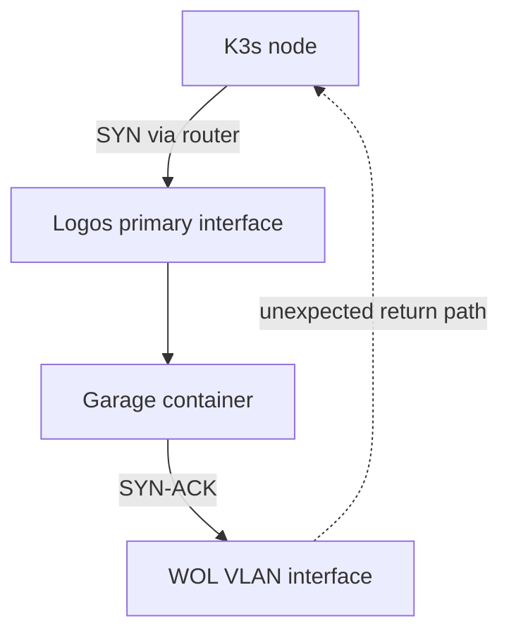

# :material-routes: WOL VLAN route asymmetry

A persistent VLAN interface used only for Wake-on-LAN created a connected route on Logos. Connections from the K3s nodes reached a Docker service through the normal router, but the replies left through the WOL interface. The asymmetric path caused TCP timeouts and prevented Loki from reaching its Garage S3 backend.

## :material-alert-outline: Symptoms

- the Garage S3 endpoint responds locally on Logos;
- the same endpoint responds from clients on the primary LAN;
- requests from the K3s nodes time out with `HTTP=000`;
- Garage logs show normal activity from other consumers;
- Loki remains `Running` but its main container is not `Ready`;
- the Loki container restarts while its rules sidecar remains healthy;
- the memberlist EndpointSlice contains the Loki Pod with `ready=false`.

The different results from separate network locations are important. They show that the application is listening and narrow the failure to one traffic path.

## :material-map-marker-path: Network model

Logos has two interfaces with separate responsibilities:

- the primary interface carries management and application traffic through the LAN router;
- the secondary VLAN interface exists only to send Wake-on-LAN broadcasts to the K3s network.

The failed connection followed different forward and return paths:



## :material-magnify: Diagnosis

### 1. Test the same endpoint from several locations

Run a bounded request without printing response content:

```bash
curl \
    --silent \
    --show-error \
    --output /dev/null \
    --connect-timeout 3 \
    --max-time 5 \
    --write-out 'HTTP=%{http_code} CONNECT=%{time_connect}s TOTAL=%{time_total}s\n' \
    http://<GARAGE_ENDPOINT>/
```

Test from:

1. Logos itself;
2. a client on the primary LAN;
3. at least one K3s node.

An unauthenticated Garage request returning `HTTP=403` is useful here. It proves that routing, the TCP handshake and HTTP response path work. It does not validate S3 credentials, bucket access or object operations.

`HTTP=000` with a timeout means that no complete HTTP response reached the client.

### 2. Inspect the selected route

On Logos, ask the kernel how it would reach the affected client:

```bash
ip route get <K3S_NODE_ADDRESS>
```

The failure is present when the selected route uses the WOL VLAN instead of the primary interface and LAN router.

Also inspect the complete interface and route state:

```bash
ip -4 -brief address
ip -4 route
networkctl status <WOL_INTERFACE> --no-pager
```

### 3. Confirm the packet path

Capture only the affected peer and service port:

```bash
sudo tcpdump \
    -ni any \
    -tttt \
    'host <K3S_NODE_ADDRESS> and tcp port <GARAGE_S3_PORT>'
```

The confirmed sequence was:

1. a SYN entered Logos through the primary path;
2. Docker forwarded it to the Garage container;
3. Garage produced a SYN-ACK;
4. the host selected the directly connected WOL VLAN for the reply;
5. the K3s node retried the SYN because the expected return path did not complete.

Do not publish a raw packet capture before checking it for private addresses or application data.

## :material-bug-check-outline: Root cause

The WOL interface had an IPv4 address in the same subnet as the K3s nodes. Linux therefore installed a connected route similar to:

```text
<K3S_SUBNET> dev <WOL_INTERFACE> scope link
```

Connected routes are created from an interface address and prefix. They are not DHCP-provided routes.

This Netplan setting was already present:

```yaml
dhcp4-overrides:
  use-routes: false
```

It prevents installation of routes offered by DHCP, but it cannot suppress the connected route required by the assigned subnet. Keeping the interface configured and active therefore continued to influence normal application traffic.

## :material-wrench-outline: Corrective action

The existing Netplan profile remains persistent, but it is no longer activated automatically:

```yaml
vlans:
  <WOL_INTERFACE>:
    activation-mode: manual
```

Generate and apply Netplan changes through a controlled procedure with console access or rollback protection. Do not restart all networking remotely as the first action.

The WOL profile can then be controlled explicitly:

```bash
sudo networkctl up <WOL_INTERFACE>
sudo networkctl down <WOL_INTERFACE>
```

The public Ansible playbook contains only the lifecycle logic. The interface name, broadcast address, management endpoint and node MAC addresses remain in private Semaphore inventory.

The Power On sequence is:

```text
validate inventory
→ activate the WOL profile
→ require a global IPv4 address
→ send WOL to every node
→ deactivate the profile in always
→ wait for SSH
→ validate K3s, API, etcd and Node Ready
```

The cleanup belongs in an Ansible `always` section so an activation or WOL failure still attempts to restore normal routing. A hard process interruption can still prevent cleanup and requires manual route inspection.

Power Off does not activate the WOL profile. Running nodes are reached through the normal routed management path.

## :material-check-decagram: Validation

The change was validated with a complete cold lifecycle test. All three physical K3s nodes were powered off before Power On was started.

After the playbook completes, verify the WOL profile:

```bash
networkctl status <WOL_INTERFACE> --no-pager |
    grep -E 'State:|Activation Policy:'
```

Expected state:

```text
State: off (configured)
Activation Policy: manual
```

Verify that ordinary traffic no longer selects the WOL interface:

```bash
ip route get <K3S_NODE_ADDRESS>
```

The route must use the primary interface and LAN router.

Validate the cluster and recovered workload:

```bash
kubectl get nodes -o wide

kubectl -n loki get pod loki-0

kubectl -n loki get endpointslice \
    -l kubernetes.io/service-name=loki-memberlist \
    -o jsonpath='{range .items[*].endpoints[*]}IP={.addresses[0]} READY={.conditions.ready} NODE={.nodeName} TARGET={.targetRef.kind}/{.targetRef.name}{"\n"}{end}'
```

The verified result was:

- all three nodes became `Ready` after the cold start;
- local K3s API and embedded etcd readiness checks passed on every server;
- the WOL profile returned to `off (configured)`;
- the normal route used the primary interface and router;
- Loki returned to `2/2 Running`;
- the memberlist endpoint changed from `ready=false` to `ready=true`.

Retries while waiting for `k3s.service` are expected during boot. The test fails only if the configured retry limit is exhausted or a later readiness assertion fails.

## :material-shield-check-outline: Prevention

- keep auxiliary VLAN profiles inactive unless an operation requires them;
- inspect `ip route get <DESTINATION>` after adding any interface address;
- test application paths from more than one network location;
- separate private inventory values from public automation logic;
- place temporary network cleanup in `always`, then verify the final route;
- send WOL to all nodes before waiting for their individual SSH endpoints;
- validate automation with the real cold-start scenario, not only syntax checks and already-running nodes;
- treat `HTTP=403` as proof of network reachability only, not proof of valid S3 access.

## :fontawesome-solid-book: Related documents

- [Zion platform](../zion/0-platform.md)
- [Kubernetes networking](../kubernetes/02-networking.md)
- [Kubernetes observability](../kubernetes/07-observability.md)
- [Kubernetes backup and Garage](../kubernetes/08-backup.md)
- [Ansible K3s power management](https://github.com/kCn3333/homelab-ansible/blob/main/docs/k3s-power-management.md)
