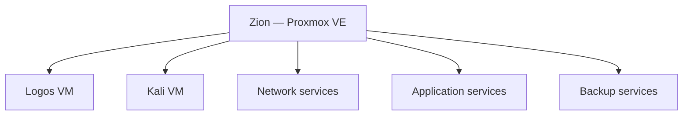

# Zion platform

Zion is the main virtualization host in the homelab. It replaced the original all-in-one Debian server with a platform where infrastructure services can be separated into virtual machines and LXC containers without turning every small service into a separate physical device.

The goal is not maximum density. The platform is designed around understandable failure domains, low idle power consumption, straightforward backups, and enough spare capacity for experiments.

## Hardware

| Component | Specification |
|---|---|
| Motherboard | Gigabyte Z370 HD3, LGA 1151 |
| CPU | Intel Core i5-8400, 6 cores at 2.8 GHz |
| Memory | 32 GB Kingston DDR4-2666 |
| CPU cooler | be quiet! Pure Rock |
| Power supply | be quiet! Pure Power 13 850 W |
| System storage | Kingston KC3000 2 TB NVMe |
| Data storage | Seagate IronWolf 4 TB SATA |
| Hypervisor | Proxmox VE |

The NVMe device holds Proxmox and the active VM/LXC disks. The IronWolf disk provides capacity for local backup storage and data that benefits more from capacity than NVMe latency.

## Virtualization layout



| Guest | Type | Purpose |
|---|---|---|
| Logos | KVM VM | Main operations server, Docker workloads, automation, backups, Garage, and WireGuard gateway |
| Kali | KVM VM | On-demand security testing and network diagnostics |
| AdGuard Home | LXC | Local DNS filtering and internal DNS rewrites |
| Caddy | LXC | Internal HTTPS reverse proxy and certificate automation |
| HAProxy | LXC | K3s API and ingress load balancing |
| PatchMon | LXC | Patch visibility and host maintenance reporting |
| Docker Media | LXC | Jellyfin and the Arr media automation stack |
| Home Assistant | LXC | Home Assistant, ESPHome, and Zigbee access |
| Proxmox Backup Server | LXC | Image-level backups of Proxmox guests |

Logos is intentionally a VM rather than an LXC because it is the primary general-purpose Linux environment and runs multiple Docker workloads. Small infrastructure services with clear boundaries are kept in dedicated LXC containers. Kali remains powered off unless it is actively needed.

## Storage model

The storage layout follows three rules:

1. Active system disks and guest workloads stay on NVMe storage.
2. Backup capacity is kept on a separate mechanical disk.
3. Large or reproducible datasets are not allowed to consume the same backup policy as critical configuration and application state.

The backup disk is exposed to Proxmox Backup Server through a bind mount. This keeps the datastore independent from the PBS container root filesystem and allows the datastore to be reattached after rebuilding the container.

## Networking

The physical interface is attached to a Linux bridge. The Proxmox management address belongs to the bridge, while the physical interface acts only as its port.

```text
physical NIC
└── Proxmox Linux bridge
    ├── Zion management interface
    ├── Logos VM
    ├── Kali VM
    └── LXC virtual interfaces
```

The physical interface is configured for link hotplug handling so that connectivity can recover after a switch or upstream network interruption. Energy Efficient Ethernet is disabled on this interface because it previously contributed to unreliable link recovery. These settings are applied through the host network configuration rather than an ad-hoc command after each failure.

Changes to the Proxmox bridge are treated as maintenance operations. The networking service is not restarted casually on a remote host because doing so can interrupt both management access and every guest attached to the bridge.

## Power management

Zion is tuned for lower idle power while retaining predictable server behaviour:

- CPU C-states, Intel Speed Shift, EIST, and supported platform power-saving features are enabled in firmware;
- unused onboard devices are disabled where practical;
- SATA link power management is enabled;
- the mechanical disk can spin down after a period of inactivity;
- PowerTOP recommendations are applied at boot through a dedicated systemd oneshot service;
- integrated graphics remains available for emergency console access and hardware-assisted media workloads.

Firmware settings that prevent Wake-on-LAN are treated as an explicit trade-off, not a universally safe optimization. Power-management changes are introduced individually and validated for network, storage, and guest stability.

## Operational boundaries

- Proxmox owns VM and LXC lifecycle; applications are managed inside the appropriate guest.
- Routine host maintenance is performed through Ansible and Semaphore.
- Package updates do not trigger an automatic reboot.
- Reboots require an explicitly approved target and post-reboot validation.
- Backups are checked as a system of independent layers rather than as a single green dashboard indicator.
- Full configuration files, credentials, recovery keys, and internal addressing remain in private operational records.

## Related documents

- [Logos operations server](logos.md)
- [Internal Caddy](caddy.md)
- [HAProxy for the K3s cluster](haproxy.md)
- [Supporting LXC services](supporting-services.md)
- [Home Assistant and Zigbee](home-assistant.md)
- [Backup and recovery](backup-and-recovery.md)
- [Maintenance and updates](maintenance.md)
- [Migration journal](migration.md)
