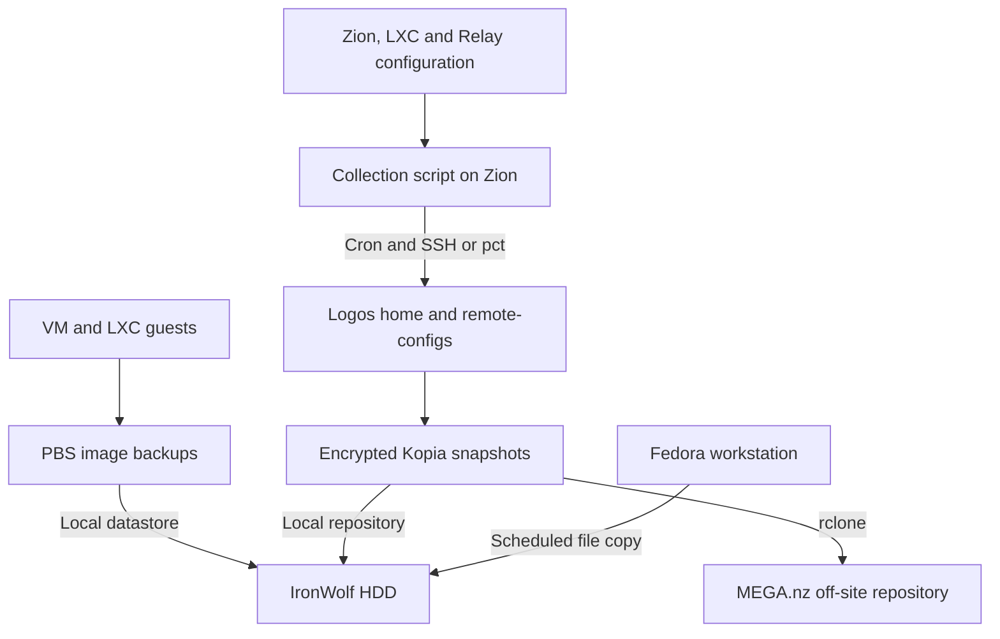

# :material-backup-restore: Backup and Recovery

The backup system has two main jobs:

- restore complete Proxmox guests quickly;
- keep enough configuration off-site to rebuild the homelab if Zion and its local backup disk are both lost.

No single layer covers every dataset or failure. A completed job is useful only if its restore path has also been tested.

## :material-family-tree: Data flow



The IronWolf contains both the PBS datastore and the local Kopia repository, but they are separate backup formats in separate paths. Losing the disk removes both local layers. The encrypted Kopia repository on MEGA is the remaining recovery source for the files included in its policies.

## :material-layers-triple: Backup layers

| Layer | Scope | Main use |
|---|---|---|
| **PBS** | Complete VM and LXC images | Restore a guest or the whole virtual environment |
| **Configuration collection** | Zion, selected LXC services and Relay configuration | Rebuild a host or recover selected configuration |
| **Kopia** | Logos `/home`, collected configuration and selected files | Local file restore and encrypted off-site recovery |
| **Fedora backup** | Administration files, dotfiles and infrastructure projects | Rebuild the workstation |

Downloaded media, caches, transcodes, build toolchains and other reproducible data are intentionally excluded where appropriate.

## :material-calendar-clock: Schedule

| Time | Job |
|---|---|
| Daily at 04:40 | Zion configuration collection |
| Daily at 04:40 | Fedora workstation backup |
| Daily at 04:50 | Kopia snapshot to MEGA |
| Sunday at 05:20 | Proxmox VM and LXC backup to PBS |
| Sunday at 06:00 | UniFi configuration backup |

The ten-minute gap between configuration collection and Kopia is intentional. The collection job must finish writing to Logos before Kopia snapshots `/home`.

## :material-server: Proxmox Backup Server

PBS runs in an unprivileged LXC on Zion. Its root filesystem is stored on NVMe, while the datastore is a bind mount from the IronWolf disk:

```text
Zion: /mnt/pve/wolfie1-4tb/pbs-backups
PBS:  /mnt/backup-storage
```

The datastore is named `ironwolf-store` and uses ext4 rather than ZFS. PBS configuration is collected separately, so the container can be recreated without treating its root filesystem as the only copy of its configuration.

PBS protects the guest system disks. Large external data mounts, including the media library, are not silently included in image backups.

### Restore a complete guest

The preferred route is the Proxmox interface:

1. Open the PBS storage in Proxmox.
2. Select the required VM or LXC snapshot.
3. Restore it to an unused VMID.
4. Keep its network interface disconnected for the first boot if the original guest still exists.
5. Start the restored guest and verify its filesystem, services and application data.
6. Reconnect networking only after excluding duplicate IP addresses and service instances.
7. Remove or replace the damaged guest only after the restored copy passes validation.

Equivalent CLI forms are available when the storage is already attached:

```bash
qmrestore <pbs-storage>:backup/vm/<vmid>/<timestamp> <new-vmid>
pct restore <new-vmid> <pbs-storage>:backup/ct/<vmid>/<timestamp>
```

Use the exact backup volume identifier reported by Proxmox; do not construct it from memory.

!!! note
    If file-level restore is unavailable in the current PBS LXC deployment, restore the backup under a temporary VMID and copy the required files from that isolated guest.

## :material-file-sync: Configuration collection

Configuration collection is performed by this script on the Proxmox host:

```text
/root/scripts/remote-backup/collect-remote-configs.sh
```

Root's cron on Zion runs it daily. The script uses local access for Zion, `pct` for LXC containers and a dedicated automation key for remote SSH. It writes the result to:

```text
/home/kcn/remote-configs/
```

on Logos. Kopia then includes that directory in the `/home` snapshot.

The collection covers:

- Proxmox network, storage and guest definitions;
- the `/etc/pve` tree as a reconstruction reference;
- internal Caddy and AdGuard configuration;
- PBS configuration;
- selected Docker Media and Home Assistant state;
- Relay Caddy, WireGuard and host-security configuration.

Logos does not need to be copied through SSH back to itself. Its selected `/home` content, including Portainer stack definitions, is read directly by Kopia.

The collector excludes caches, media artwork, transcodes, logs and build output. `/etc/pve` is reference material only—it must not be copied over a running `pmxcfs` filesystem.

### Restore collected configuration

1. Restore the required directory from Kopia into a temporary location.
2. Stop the affected service or container.
3. Compare the restored files with the current configuration.
4. Copy only the required files using `pct push`, `scp` or a local copy on Zion.
5. Restore the expected owner, group and mode.
6. Run the service's configuration validator where one exists.
7. Start or reload the service and inspect its logs.
8. Create a new configuration collection after confirming the repair.

Do not restore the complete collection tree blindly. It contains files from different hosts and different points in their lifecycle.

## :material-safe: Kopia repositories

Kopia runs in Docker on Logos and reads selected source directories through read-only mounts. It writes two repositories:

- a local repository on the IronWolf for quick file recovery;
- an off-site repository reached through `rclone` on MEGA.nz.

Kopia encrypts repository content on Logos before it is written locally or sent to MEGA. MEGA stores encrypted repository blocks, not plain files from `/home` or `remote-configs`.

The repository password is required to decrypt either repository. The MEGA account and `rclone` configuration provide access to the remote storage but do not replace the Kopia repository password. Both must be kept outside Zion.

### Restore files from Kopia

Using the web interface:

```text
Snapshots → source → snapshot → Browse → select files → Download
```

Using the container CLI:

```bash
docker exec -it kopia kopia snapshot list
docker exec -it kopia kopia restore <snapshot-id>/<path> /tmp/restored
```

Restore into a temporary directory first. Check the contents and ownership before copying anything into an active application directory.

## :material-harddisk-remove: Recovery scenarios

### One file or one service is damaged

1. Stop writes to the affected service.
2. Select the newest snapshot from before the damage.
3. Restore into a temporary directory.
4. Compare the restored version with the current files.
5. Restore only the required data and permissions.
6. Validate the configuration, database or application state.
7. Start the service and check its logs.
8. Run a fresh backup after the repair.

Use Kopia for individual files and collected configuration. Use a temporary PBS restore when the required data exists only inside a guest image.

### A VM or LXC is damaged

1. Stop or isolate the damaged guest.
2. Confirm the timestamp and status of the PBS backup.
3. Restore to an unused VMID with networking disconnected.
4. Boot the restored guest and verify storage, services and application data.
5. Confirm its network configuration before connecting it to the LAN.
6. Replace the damaged guest only after the isolated restore passes.
7. Run configuration collection and a new PBS backup.

### Zion's NVMe fails but the IronWolf survives

1. Disconnect or preserve the failed NVMe. Do not initialize the IronWolf.
2. Install Proxmox on replacement system storage.
3. Restore the host network and verify access to the IronWolf filesystem.
4. Mount the existing disk and confirm the PBS datastore directory before changing permissions.
5. Recreate the PBS LXC with the required unprivileged-container features.
6. Verify the `backup` user's UID mapping inside the new container before attaching the bind mount.
7. Attach the existing datastore path and add `ironwolf-store` in PBS.
8. Add the PBS storage to Proxmox and confirm that existing snapshots are visible.
9. Restore DNS and the internal reverse proxy first, then Logos and the remaining guests.
10. Validate networking, applications and backup jobs.
11. Create and verify a new PBS backup.

!!! warning
    Do not run a recursive `chown`, format the IronWolf or create a new datastore over the existing directory until its filesystem and ownership have been inspected.

### Zion and the IronWolf are both lost

In this case the PBS images and local Kopia repository are gone. Recovery starts from the encrypted MEGA repository:

1. Prepare a temporary Linux host with Docker and a compatible `rclone` version.
2. Recover the MEGA account, `rclone` configuration and Kopia repository password from the external password store or recovery media.
3. Start a clean Kopia container with persistent configuration and cache directories.
4. Connect Kopia to the existing `rclone` repository.
5. List snapshots and restore `/home` plus `remote-configs` into a staging directory.
6. Verify the restored configuration before rebuilding any production host.
7. Install Proxmox on replacement hardware.
8. Recreate the required VMs and LXC containers from the collected guest definitions and documentation.
9. Restore DNS, internal proxying and Logos before dependent applications.
10. Restore application configuration and data covered by Kopia.
11. Recreate PBS on new local storage.
12. Run new configuration, Kopia and PBS backups, then test one restore from each layer.

The remote repository can be connected from the Kopia container with:

```bash
docker exec -it kopia kopia repository connect rclone \
    --remote-path=<rclone-remote>:<repository-path>
```

Enter the repository password interactively. Do not place it in shell history, Compose files or this documentation.

## :material-order-bool-ascending-variant: Service recovery order

When several systems are unavailable, restore dependencies in this order:

1. Proxmox network and storage.
2. PBS datastore, if the IronWolf survived.
3. AdGuard DNS and internal Caddy.
4. Logos, including Docker and automation data.
5. HAProxy when the K3s cluster is needed.
6. Home Assistant, Docker Media and supporting services.
7. Relay and its restricted WireGuard paths.
8. Monitoring and scheduled maintenance.

Start public or internal reverse proxies only after their backends are available.

## :material-alert-outline: Coverage limits

- PBS and the local Kopia repository share the same physical disk and site.
- Loss of the IronWolf removes all local backup history.
- Off-site recovery includes only data selected by Kopia policies.
- Large media files and reproducible caches are not sent to MEGA.
- Some application datasets are excluded from Kopia and depend on PBS or another dedicated copy.
- The `/etc/pve` snapshot supports manual reconstruction; it is not a drop-in Proxmox restore.
- MEGA capacity limits off-site retention.

Review exclusions whenever a service becomes important or starts storing unique data.

## :material-check-decagram: Restore validation

| Layer | Required test |
|---|---|
| PBS | Restore one guest to an isolated VMID and boot it |
| Configuration collection | Restore one service directory and validate its contents |
| Local Kopia | Restore selected files to a temporary directory |
| MEGA Kopia | Connect to the remote repository and restore selected files |
| Fedora backup | Restore a test subset without overwriting the workstation |

After any major recovery, run every backup layer again and verify that the new snapshots are visible and restorable.