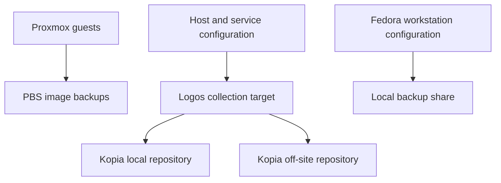

# Backup and recovery

The homelab backup design uses multiple independent layers. No single layer protects every failure mode, and a successful scheduled job is not considered proof that recovery works.

## Design goals

- restore complete Proxmox guests after a host or system-disk failure;
- preserve service configuration independently from guest images;
- keep selected critical data outside the physical Zion platform;
- avoid backing up reproducible caches and downloaded media as if they were unique data;
- retain enough documentation to rebuild services when image-level restore is unavailable.

## Backup layers

| Layer | Protects | Primary recovery use |
|---|---|---|
| Proxmox Backup Server | VM and LXC images | Full guest restore |
| Remote configuration collector | Proxmox, LXC, Relay, and service configuration | Rebuild or targeted configuration recovery |
| Kopia | Selected Logos data and collected configuration | File-level local and off-site recovery |
| Workstation backup | Selected dotfiles, tooling configuration, and infrastructure projects | Restore the administration workstation |

The layers run in a deliberate order so that freshly collected configuration can be included in the later file backup. Exact schedules are maintained privately because they are operational details rather than architecture.

## Proxmox Backup Server

PBS runs in an unprivileged LXC on Zion. Its datastore resides on the IronWolf disk and is bind-mounted into the container. The datastore is therefore separate from the PBS root filesystem.

This arrangement allows the following recovery pattern:

1. reinstall Proxmox on replacement system storage;
2. reconnect the surviving backup disk;
3. recreate the PBS container;
4. attach the existing datastore path;
5. allow PBS to discover the datastore content;
6. reconnect PBS to Proxmox;
7. restore the required guests.

PBS itself is reproducible. Its configuration is collected separately, while the backup datastore is the important persistent component.

Running PBS in an LXC is a practical compromise. Some file-level recovery features may be more limited than with a dedicated PBS VM, so recovery tests include both complete guest restoration and targeted data extraction through a temporary restore.

## Configuration collection

A collector running from Zion obtains selected configuration and application state from the host, local LXC containers, Logos, and the external Relay. The result is stored on Logos before Kopia creates its snapshots.

Collected material includes categories such as:

- Proxmox network, storage, and guest definitions;
- Caddy and AdGuard configuration;
- PBS configuration;
- selected Docker Media and Home Assistant application state;
- Relay proxy, WireGuard, and host-security configuration.

Cache directories, generated artwork, transcodes, logs, build toolchains, and other reproducible data are excluded. The collector uses a dedicated automation key rather than a personal administration key.

The configuration copy of `/etc/pve` is a reference for reconstruction, not a file-level replacement for the Proxmox cluster filesystem.

## Kopia

Kopia runs on Logos and protects selected files using two repository classes:

- a local repository for fast recovery;
- an off-site repository for loss of the complete Zion platform.

The source filesystem is mounted read-only into the Kopia container. Repository and UI passwords are supplied through runtime secrets and are not embedded in Compose files or documentation.

Kopia policies exclude large datasets that already have another protection mechanism, volatile databases that require application-aware handling, and reproducible development caches. Exclusions are reviewed whenever a new service is introduced.

## Recovery priorities

In a major failure, recovery proceeds by dependency rather than by VM identifier:

1. restore Proxmox networking and storage access;
2. make the PBS datastore available;
3. restore DNS and internal reverse proxy services;
4. restore Logos and the automation environment;
5. restore application and home-automation guests;
6. restore the Relay configuration and verify the narrow WireGuard paths;
7. validate backups again from the recovered environment.

The private disaster-recovery runbook contains exact paths, repository identifiers, account recovery information, and credentials. Those details are intentionally excluded from this public repository.

## Validation policy

A backup layer is considered usable only after a restore test appropriate to that layer:

| Layer | Minimum validation |
|---|---|
| PBS | Restore a guest or temporary clone and boot it in isolation |
| Configuration collector | Inspect a recent archive and restore a selected configuration into a temporary location |
| Kopia | Browse a recent snapshot and restore selected files from both repository classes |
| Workstation backup | Restore a test subset without overwriting the active workstation |

Validation also confirms that failed jobs, stale repositories, storage capacity, and retention are reported rather than silently ignored.

## Known limitations

- Local image backups and the primary platform share the same physical site.
- Some large datasets intentionally have different or local-only protection policies.
- Application-consistent databases may require their own export or snapshot procedure.
- Rebuilding Proxmox from configuration snapshots still requires operator judgment.
- Off-site capacity constrains retention and must be reviewed as protected data grows.

These limitations are tracked privately with the exact affected datasets. Publishing the full coverage gaps would reveal more operational detail than is useful for the public architecture documentation.

