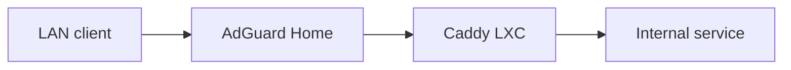

# Internal Caddy

Caddy provides internal HTTPS termination and reverse proxying for services hosted across Zion and Logos. It runs natively as a systemd service in a dedicated LXC so that internal service access does not depend on the Docker engine or the availability of a general-purpose application host.

## Request flow



AdGuard Home resolves the internal service name to Caddy. Caddy obtains or presents the appropriate certificate and proxies the request to the selected backend.

## Configuration layout

The configuration is split into one small site file per backend:

```text
/etc/caddy/
├── Caddyfile
├── .env
└── sites/
    ├── service-a.caddy
    ├── service-b.caddy
    └── ...
```

The main file contains global options and imports the site directory:

```caddy
{
    acme_dns cloudflare {env.CLOUDFLARE_API_TOKEN}
}

import /etc/caddy/sites/*.caddy
```

The DNS provider credential is stored in an environment file with restricted permissions and loaded by the systemd unit. It is never committed to the repository.

## Adding an internal service

1. Create a dedicated file under `sites/`.
2. Add or update the corresponding DNS rewrite in AdGuard Home.
3. Format and validate the complete configuration.
4. Reload Caddy gracefully.
5. Test the certificate, response headers, and backend reachability.

```bash
caddy fmt --overwrite /etc/caddy/Caddyfile
caddy validate --config /etc/caddy/Caddyfile
caddy reload --config /etc/caddy/Caddyfile
```

A basic backend definition remains intentionally small:

```caddy
service.internal.example {
    reverse_proxy <backend-address>:<backend-port>
}
```

Caddy handles WebSocket upgrades automatically through `reverse_proxy`. Forwarded headers are customized only when the backend application requires explicit proxy awareness.

## HTTPS backends

Some administrative applications expose only HTTPS with a self-signed certificate. Disabling upstream certificate verification is treated as a compatibility exception:

```caddy
service.internal.example {
    reverse_proxy https://<backend-address>:<backend-port> {
        transport http {
            tls_insecure_skip_verify
        }
    }
}
```

Where practical, a trusted internal CA or correctly validated backend certificate is preferred.

## Configuration ownership

- Caddy owns HTTPS and proxy routing.
- AdGuard Home owns internal name resolution.
- Backend applications own authentication and application authorization.
- Public access is configured separately from the internal reverse proxy.

A proxy configuration is not used to conceal an application that lacks suitable authentication.

## Validation

```bash
caddy validate --config /etc/caddy/Caddyfile
systemctl is-active caddy
systemctl is-enabled caddy
journalctl -u caddy --no-pager -n 50
```

Validation after a change also confirms that:

- the internal DNS answer points to Caddy;
- the expected certificate is presented;
- the backend is reachable from the Caddy LXC;
- no unexpected failed systemd units remain.

## Troubleshooting order

| Symptom | First checks |
|---|---|
| Name does not resolve | AdGuard record or rewrite and client DNS cache |
| Certificate is not issued | DNS provider credential, Caddy modules, and ACME logs |
| HTTP 502 | Backend address, listener, route, and firewall |
| Configuration reload fails | `caddy fmt`, `caddy validate`, and systemd logs |
| Backend rejects the request | Proxy trust and forwarded-header configuration |

The current service state is checked before restarting Caddy. Reload is preferred for ordinary configuration changes because it avoids unnecessary interruption.

