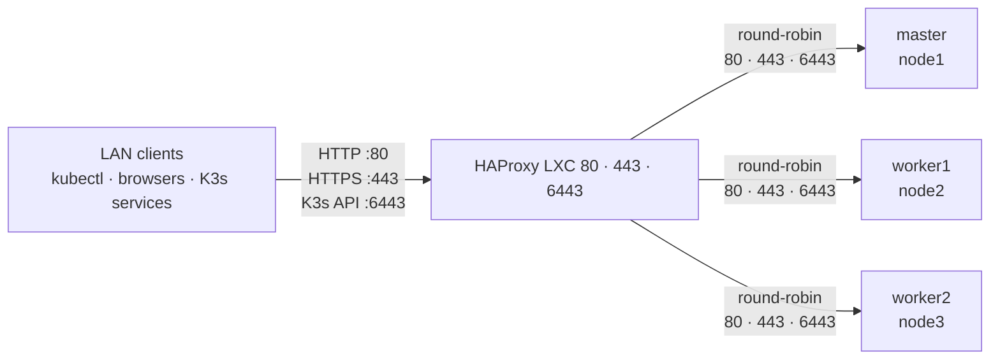

# :material-web: HAProxy for K3s

HAProxy is the external load balancer in front of the K3s cluster. It exposes one stable LAN address and distributes API and ingress traffic across all three K3s nodes. It runs natively in a small LXC on Zion.

***

## :simple-linuxcontainers: LXC

| Property | Value |
|---|---|
| System | Debian 13, unprivileged LXC |
| CPU | 1 vCPU |
| Memory | 256 MB |
| Swap | 256 MB |
| Root disk | 4 GB |
| Runtime | Native `haproxy.service` |

HAProxy is stateless. Its important state is the configuration file:

```text
/etc/haproxy/haproxy.cfg
```

## :material-call-split: Traffic and load balancing



All three K3s machines are control-plane and embedded-etcd nodes despite the historical names `master`, `worker1` and `worker2`.

Each backend uses `balance roundrobin`. New API and HTTPS connections, and HTTP requests, are distributed between available nodes. Backend health checks keep an unavailable node out of rotation.

The API and HTTPS frontends use TCP mode. TLS passes through HAProxy and is terminated by K3s or Traefik. Port `80` uses HTTP mode. HAProxy therefore stores no kubeconfig, cluster credentials or application certificates.


## :material-docker: Why it left Docker

The old HAProxy ran in Docker on Oracle Legacy and used an additional address assigned to that host. This created two dependencies for a critical cluster endpoint: the Docker engine and the network configuration of a general-purpose server.

The replacement LXC owns IP address directly. It can start, stop, update and restore without Logos or another Docker host.

The previous deployment is retained as a reference:

- [legacy Compose definition](https://github.com/kCn3333/docker-compose/blob/main/haproxy/docker-compose.yaml)
- [HAProxy configuration](https://github.com/kCn3333/docker-compose/blob/main/haproxy/haproxy.cfg)

## :material-transit-connection-variant: Migration and cutover

The migration was deliberately simple because HAProxy has no application data:

1. Record the legacy listeners, backend addresses and timeouts.
2. Create the Debian LXC with its final CPU, memory and disk limits.
3. Install native HAProxy.
4. Copy the existing `haproxy.cfg` to `/etc/haproxy/haproxy.cfg`.
5. Validate it with `haproxy -c`.
6. Stop the legacy HAProxy container and remove the additional address from Oracle Legacy.
7. Assign the same IP address to the new LXC.
8. Start HAProxy and verify listeners `80`, `443` and `6443`.
9. Test the Kubernetes API and one ingress route.
10. Keep the old container stopped until the LXC passes normal operation and backup.

### Why K3s clients did not change

The network identity and ports stayed the same. Internal DNS for the cluster continued to resolve same IP address, so:

- kubeconfig API endpoints remained valid;
- K3s `--server` references remained valid;
- ingress consumers kept the standard HTTP and HTTPS frontend ports.

The cutover changed the machine behind the endpoint, not the endpoint itself.

## :material-file-cog-outline: Configuration rules

- API, HTTP ingress and HTTPS ingress use separate frontend and backend sections.
- API and HTTPS use TCP mode; HTTP uses HTTP mode.
- `balance roundrobin` distributes traffic across the three nodes.
- Every K3s node is listed in the relevant backend.
- Backend checks remove unavailable nodes from rotation.
- Connect, client and server timeouts are explicit.
- Configuration is validated before reload or restart.
- HAProxy process health and K3s backend health are checked separately.

Kubernetes application routing remains in Flux and Kubernetes. HAProxy only forwards traffic to the cluster.

## :material-check-decagram: Validation

```bash
sudo haproxy -c -f /etc/haproxy/haproxy.cfg
systemctl is-active haproxy
systemctl is-enabled haproxy
ss -lnt
journalctl -u haproxy --no-pager -n 50
```

Functional checks:

1. Confirm all three frontend ports are listening.
2. Test every backend from the HAProxy LXC.
3. Check Kubernetes API readiness through the frontend.
4. Open one internal ingress endpoint through HAProxy.
5. Confirm that no unexpected systemd units are failed.

## :material-wrench-outline: Quick diagnosis

| Observation | Check |
|---|---|
| Configuration validation fails | `haproxy.cfg` syntax and section mode |
| Frontend port is closed | `haproxy.service` and local listener |
| One backend fails | Node state and VLAN reachability |
| API works but an application fails | Ingress, Service, DNS or application |
| Every backend fails | Cluster power, VLAN, switch or HAProxy route |