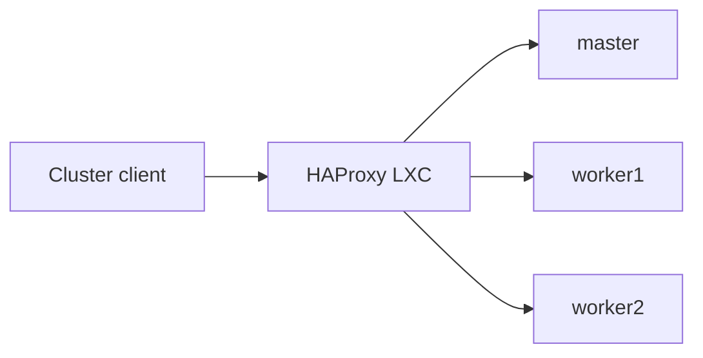

# HAProxy for the K3s cluster

HAProxy provides stable LAN frontends for the K3s API and ingress traffic. It runs natively in a dedicated LXC on Zion and is independent from the Docker workloads on Logos.

## Architecture



Despite their historical inventory names, all three K3s nodes participate in the control plane and embedded etcd quorum.

## Traffic classes

HAProxy keeps two responsibilities separate:

- Kubernetes API traffic is forwarded in TCP mode to the control-plane endpoints;
- ingress HTTP and HTTPS traffic is forwarded to the cluster ingress endpoints.

TLS remains end-to-end for the Kubernetes API. HAProxy does not need access to Kubernetes credentials or application secrets.

## Why a dedicated LXC

HAProxy previously ran as a Docker container on Oracle Legacy and depended on an additional address attached to that host. The replacement LXC owns its network identity directly.

This removes several unnecessary dependencies:

- no Docker daemon is required for cluster routing;
- no secondary address must be recreated on a general-purpose host;
- the service can be backed up and restored independently;
- configuration and systemd state are visible through ordinary host tooling.

## Configuration principles

- all three K3s nodes are represented as backends;
- Kubernetes API and ingress use separate frontends and backend groups;
- TCP mode is used where HAProxy must not terminate application TLS;
- timeouts are explicit;
- configuration is validated before reload;
- a running HAProxy process is not treated as proof that the K3s backends are healthy.

Node addresses are operational configuration and are not published in this repository. Cluster application routing remains managed by Flux and Kubernetes rather than HAProxy.

## Validation

```bash
haproxy -c -f /etc/haproxy/haproxy.cfg
systemctl is-active haproxy
systemctl is-enabled haproxy
journalctl -u haproxy --no-pager -n 50
```

After a configuration or platform change, validation covers:

1. HAProxy configuration syntax;
2. expected frontend listeners;
3. reachability of each K3s backend;
4. Kubernetes API readiness through the frontend;
5. an internal ingress request through the frontend;
6. absence of unexpected failed systemd units.

## Failure interpretation

| Observation | Likely layer |
|---|---|
| HAProxy configuration is invalid | Local HAProxy configuration |
| Frontend is closed | HAProxy service or host listener |
| API frontend responds but a node is unhealthy | K3s node or backend reachability |
| API works but an application does not | Ingress, service, DNS, or application layer |
| Every backend becomes unavailable together | Cluster power, network segment, or upstream switch |

This separation prevents an application-level incident from being misdiagnosed as a load-balancer failure.

