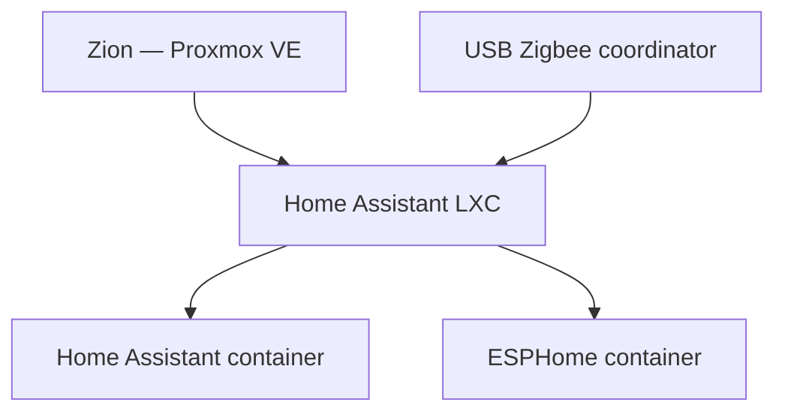

# Home Assistant and Zigbee

Home Assistant and ESPHome run in Docker inside a dedicated LXC on Zion. The container was created during the migration from Oracle Legacy so that home automation and its USB hardware no longer depend on the general-purpose server.

## Architecture



The LXC uses nesting for Docker and receives the Zigbee serial device through an explicit device passthrough. Home Assistant uses host networking, while ESPHome exposes only its required service port.

## Why a dedicated LXC

- USB ownership and restart behaviour are isolated from unrelated Docker workloads;
- Home Assistant and ESPHome can be backed up and restored together;
- the Zigbee coordinator remains attached to one predictable guest;
- maintenance of Logos does not interrupt local automations;
- the trust implications of USB passthrough are confined to one workload.

## USB passthrough

The coordinator uses a Silicon Labs CP210x USB-to-UART bridge and appears as a `ttyUSB` device. Proxmox grants the LXC access to the relevant character-device major number and bind-mounts the device into the container.

The essential LXC configuration is equivalent to:

```ini
features: nesting=1,fuse=1
unprivileged: 0
lxc.cgroup2.devices.allow: c 188:* rwm
lxc.mount.entry: /dev/ttyUSB0 dev/ttyUSB0 none bind,optional,create=file
```

The privileged LXC is a deliberate exception required by the current USB passthrough model. It increases the impact of a container compromise, so the guest is kept narrow, patched, and inaccessible from untrusted networks.

The application refers to `/dev/ttyUSB0` inside the LXC. Host-side `/dev/serial/by-id/` links are not assumed to exist inside the container.

## Container layout

```yaml
services:
  homeassistant:
    image: ghcr.io/home-assistant/home-assistant:stable
    restart: unless-stopped
    network_mode: host
    volumes:
      - ./homeassistant:/config
      - /etc/localtime:/etc/localtime:ro
    devices:
      - /dev/ttyUSB0:/dev/ttyUSB0

  esphome:
    image: ghcr.io/esphome/esphome:stable
    restart: unless-stopped
    volumes:
      - ./esphome:/config
      - /etc/localtime:/etc/localtime:ro
    environment:
      TZ: Europe/Warsaw
```

The production Compose definition and secrets are maintained outside this documentation. The example shows only the workload boundaries and required device mapping.

## Migration rules

Home Assistant must be stopped before copying its configuration directory. Copying the SQLite database while the application is running risks an inconsistent backup.

The migration followed this order:

1. create and validate the destination LXC;
2. configure USB passthrough before starting the application;
3. stop Home Assistant and ESPHome on Oracle Legacy;
4. transfer application state while preserving ownership and modes;
5. update the saved Zigbee serial path;
6. start the containers on Zion;
7. validate ZHA devices, ESPHome, proxy access, and backups;
8. keep the old containers stopped until the new environment is proven stable.

## Reverse proxy awareness

Home Assistant is configured to trust only the proxy addresses that legitimately forward requests to it. Broad Docker ranges should not be added merely to silence an `untrusted proxy` log entry unless the resulting trust boundary is understood.

External access requires multi-factor authentication. Public exposure, tunnel configuration, and identity controls are documented separately from the local LXC deployment.

## Validation

```bash
test -c /dev/ttyUSB0
docker compose ps
docker logs homeassistant --since 10m
docker logs esphome --since 10m
```

The operational check also confirms:

- ZHA is connected and expected devices are present;
- ESPHome can reach managed devices;
- no unexpected proxy errors are logged;
- key-only SSH and non-interactive automation access still work;
- the latest configuration backup includes both application directories.

## Known pitfalls

| Symptom | Likely cause |
|---|---|
| Zigbee device is absent inside the LXC | Device passthrough or cgroup permission is missing |
| Home Assistant still references the old device | ZHA retained the pre-migration serial path |
| SSH key exists but authentication fails | Ownership was inherited from an earlier unprivileged-container mapping |
| Proxy requests are rejected | The actual proxy is missing from `trusted_proxies` |
| Package management reports permission warnings | Container privilege and ownership mapping require review |

